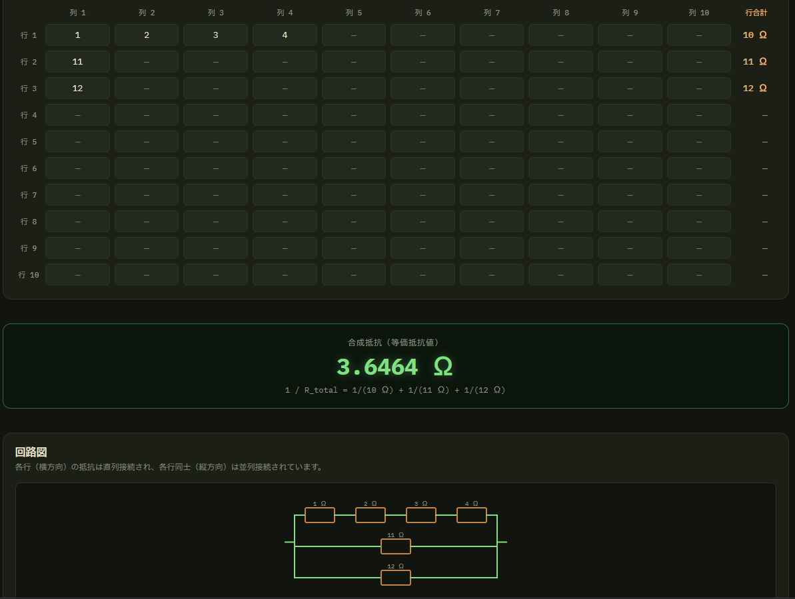
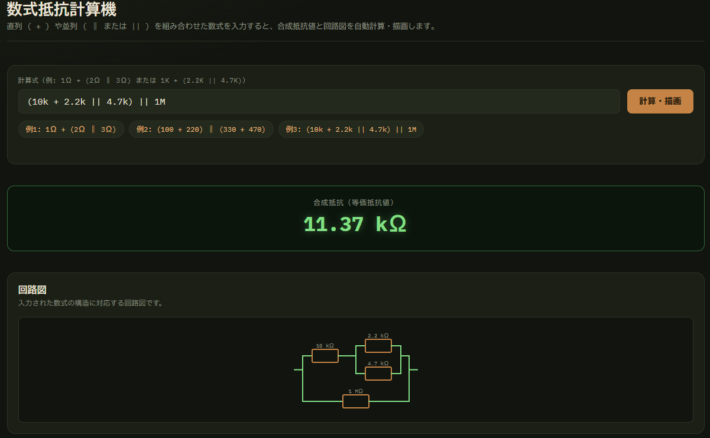
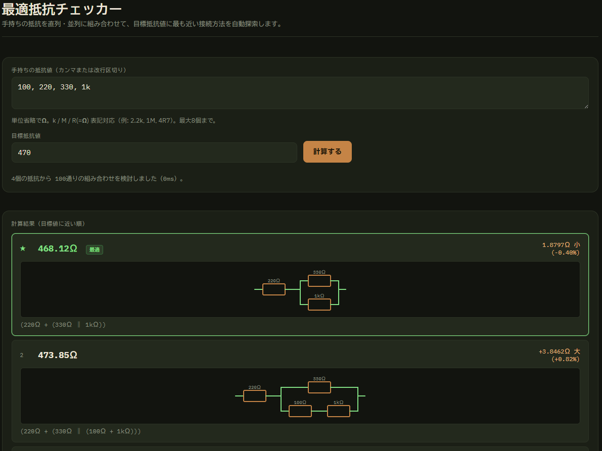

# Resistor Toolkit

[](https://opensource.org/licenses/MIT)

[日本語版 README](README.md)

**Resistor Toolkit** is a lightweight, modern web-based utility toolkit designed for electronics engineers, hobbyists, and students.
Built with pure static web standards, it runs directly in your browser with zero build steps or package dependencies required.

## 🔗Public Page
[https://OtabiHirohito.github.io/ResistorToolkit/](https://OtabiHirohito.github.io/ResistorToolkit/)

## 🚀 Features

### 1. Resistor Color Code Calculator
- **4-Band & 5-Band Support**: Toggle instantly between standard 4-band and precision 5-band resistor color codes.
- **Visual Resistor Graphic**: Dynamic SVG resistor graphic updates colors in real time as you pick bands.
- **Tolerance Range Calculation**: Computes nominal resistance along with the minimum/maximum resistance range based on band tolerances.
- **Color Quick Reference**: Built-in lookup table for digits, multipliers, and tolerances.


### 2. Spreadsheet Resistance Calculator
- **10×10 Grid Input**: Enter resistor values into a 10×10 matrix grid to synthesize overall resistance.
  - **Series & Parallel Connections**: Resistors in the same row connect in series, and rows connect in parallel.
- **Interactive Circuit Schematic**: Automatically generates a clean, scalable SVG schematic diagram underneath the calculation result.
- **Flexible Value Input**: Supports standard engineering notation (e.g. `100`, `1k`, `4.7k`, `1M`, `4R7`).
- **Keyboard Navigation**: Move smoothly around the grid using arrow keys (`Up`, `Down`, `Left`, `Right`).


### 3. Resistor Formula Calculator
- **Algebraic Formula Calculations**: Enter equations combining series (`+`) and parallel (`‖` or `||`) operators with parentheses (e.g. `1Ω + (2Ω ‖ 3Ω)`, `(100 + 220) || (330 + 470)`).
- **Equivalent Resistance & Circuit Diagram**: Computes the exact equivalent resistance and dynamically renders its SVG circuit schematic.


### 4. Optimal Resistance Network Solver
- **Target Value Optimization**: Input your stock of available resistors and a target resistance to discover the best series/parallel topologies.
- **Ranked Results & Errors**: Displays ranked results closest to target with absolute error (Ω) and percentage error (%).
- **Circuit Visualization**: Generates schematic diagrams for each suggested network combination.


## 🌐 Internationalization

On first visit, the app automatically checks your browser's language preferences—displaying Japanese if your browser language is Japanese, and defaulting to English for all other languages.
A language toggle switch (`日本語` / `English`) is available at the top right on every tab, allowing you to manually switch languages anytime. Your preference is automatically saved in your browser.

## 💻 How to Run Locally

Since **Resistor Toolkit** is built using standard HTML5, CSS3, and JavaScript ES Modules, no build step or Node package installation is needed!

1. Clone or download the repository:
   ```bash
   git clone https://github.com/OtabiHirohito/ResistorToolkit.git
   cd ResistorToolkit
   ```
2. Serve the directory with any static web server:
   ```bash
   # Using Python 3:
   python3 -m http.server 8000
   ```
3. Open the following in your browser.
   ```
   http://localhost:8000/
   ```

## 🤝 Donations

If you find this software useful, please consider supporting the following organizations:
<sub>*The software and creator are not affiliated with these organizations.*</sub>

* [Donation 1](https://jawfp.my.site.com/jawfp/s/donation "WFP")
* [Donation 2](https://smilecat.jp/support/ "smile cat")

## 📄 License

This project is released under the **MIT License**. See [LICENSE.txt](LICENSE.txt) for details.

---

Created by Hirohito Otabi / X (Twitter): [@OtabiHirohito](https://x.com/OtabiHirohito)
